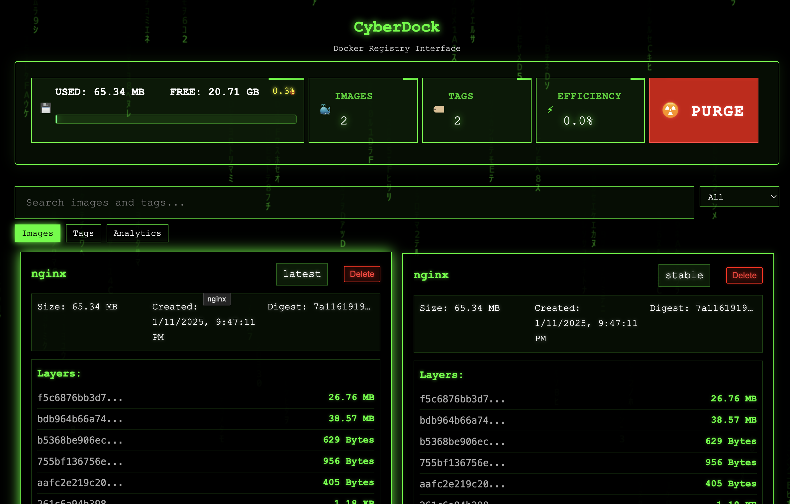
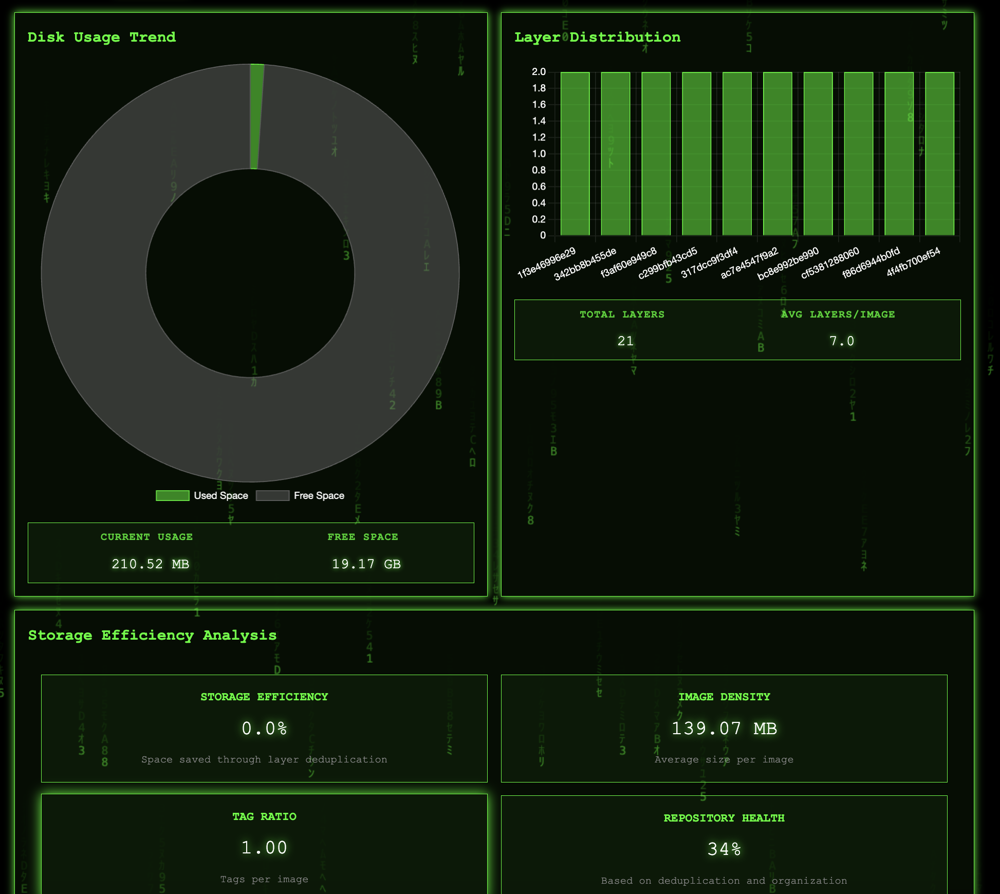

<div align="center">
<table>
  <tr>
    <td>
      
    </td>
    <td>
      
    </td>
  </tr>
</table>
</div>

<div align="center">
  <h1>CyberDock</h1>
  <p><strong>Cyberpunk Docker Registry Interface</strong></p>
  <p>🐳 Docker Registry | 🌍 Web UI | ⚡ Fast | 🎨 Beautiful | 🔒 Secure</p>
  <p>
    
    
    
    
  </p>
</div>

CyberDock is a sleek, cyberpunk-themed Docker Registry with an integrated web interface. It combines a fully compliant OCI Distribution registry with a beautiful, real-time UI for managing your container images.

> The intention is to provide a simple, secure, and efficient way to replay and manage your Docker images.

## 🌟 Features

<table>
  <tr>
    <th>Registry Features</th>
    <th>Content Support</th>
  </tr>
  <tr>
    <td>
      <ul>
        <li>Full OCI Distribution Specification compliance</li>
        <li>Local filesystem storage with deduplication</li>
        <li>Efficient blob mounting between repositories</li>
        <li>Atomic operations for data integrity</li>
        <li>Automatic cleanup of incomplete uploads</li>
        <li>Real-time storage statistics</li>
        <li>Built-in garbage collection</li>
      </ul>
    </td>
    <td>
      <ul>
        <li>Docker V2 manifests and lists</li>
        <li>OCI manifests and image indexes</li>
        <li>Container configs</li>
        <li>Layer tarballs</li>
        <li>Cross-repository blob mounting</li>
        <li>Range request support</li>
        <li>🎉v0.2.0:Garbage collection</li>
      </ul>
    </td>
  </tr>
  <tr>
    <th>Web Interface</th>
    <th>Security</th>
  </tr>
  <tr>
    <td>
      <ul>
        <li>Cyberpunk-themed responsive design</li>
        <li>Real-time statistics and monitoring</li>
        <li>Image and tag management</li>
        <li>Storage efficiency tracking</li>
        <li>Layer analysis and visualization</li>
        <li>Search and filtering capabilities</li>
        <li>Secure HTTPS access</li>
      </ul>
    </td>
    <td>
      <ul>
        <li>Automatic TLS certificate generation</li>
        <li>Content verification through digests</li>
        <li>Proper file permissions</li>
        <li>Safe concurrent access</li>
        <li>Secure temporary file handling</li>
      </ul>
    </td>
  </tr>
</table>

## 🚀 Quick Start

### Docker

Docker image is a simple way to get started.

#### Single-Port Mode (Recommended)
```bash
# Run on port 5000 (both registry and UI)
docker run -d --name cyberdock -p 5000:5000 mattrogers/cyberdock:latest
```

Access points:
- Registry API: https://localhost:5000/v2/
- Admin UI: https://localhost:5000/admin/
- Root (/) redirects to /admin/


If you have a mac 🍏 host and want to work around the port conflicts:
```bash
# Single-port mode on custom port
docker run -d --name cyberdock -p 5005:5000 mattrogers/cyberdock:latest
# Access at https://localhost:5005/admin/
```

## 💻 Usage

### Single-Port Mode (Default)
CyberDock now runs both the registry and admin UI on a single port by default, simplifying deployment:
```bash
./cyberdock -p 5000
```

Path-based routing:
- `/v2/*` - Docker Registry API (for docker push/pull)
- `/admin/*` - Web UI for managing the registry
- `/api/*` - Management API endpoints
- `/static/*` - Static assets for the UI
- `/` - Redirects to `/admin/`

### Kubernetes Deployment

Deploy CyberDock to your Kubernetes cluster using metallb for load balancing. You can add your cert via the UI, by default generates a self-signed cert. You'll need to restart the pod to apply the new cert.

```bash
kubectl apply -f kubernetes/cyberdock.yaml
```


### Remote Purge ☢️
```bash
curl -k -X POST https://cyberdock:5000/api/purge
```

### Docker Client Configuration

The Docker client works seamlessly with both single-port and dual-port modes.

Add to your Docker daemon configuration:
```json
{
  "insecure-registries": ["localhost:5000"]
}
```

### Push Images
```bash
docker tag your-image:tag localhost:5000/your-image:tag
docker push localhost:5000/your-image:tag
```

### Pull Images
```bash
docker pull localhost:5000/your-image:tag
```

## 🔧 Configuration

Command line flags:
```bash
# Single-port mode (default)
-p PORT  # Run both registry and UI on single port (default: 5000)

# Dual-port mode (legacy)
-r PORT  # Set registry port (default: 5000)
-g PORT  # Set web UI port (default: 5001)
```

Note: When both `-r` and `-g` are specified, CyberDock automatically switches to dual-port mode for backward compatibility.

## ⚡️ Updates

- 0.3.4d:
  - Fixed bugs in UI showing incorrect storage totals.


- 0.3.3d:
  - Fixed tag update bug that prevented pushing latest tags over existing images
  - Enhanced support for multi-level repository paths (org/team/project)
  - Improved layer deduplication - shared layers now properly preserved during updates
  - Added comprehensive path validation across all registry operations

- 0.3.2d:
  - Added single-port mode as default deployment option
  - Fixed /admin routing in single-port mode
  - Simplified deployment with path-based routing
  - Added certificate management UI (upload custom certs or generate new ones)
  - Maintained backward compatibility with dual-port mode

- 0.3.1d:
  - Added project group and name to the UI (issue #3)

- 0.3.0d:
  - Added storage efficiency analysis
  - Added image density metric
  - Added repository health metric
  - Added total layers and average layers per image metrics
  - Added layer distribution chart
  - Bugfixes for dashes and long names

<div align="center">
  
  


## ⚖️ License

<p>
CyberDock is licensed under the GNU General Public License v3.0 (GPLv3).<br>
<em>Free Software</em>
</p>

[](https://www.gnu.org/licenses/gpl-3.0)

### Connect With Me 🤝

[](https://github.com/RamboRogers)
[](https://x.com/rogerscissp)
[](https://matthewrogers.org)

</div>

