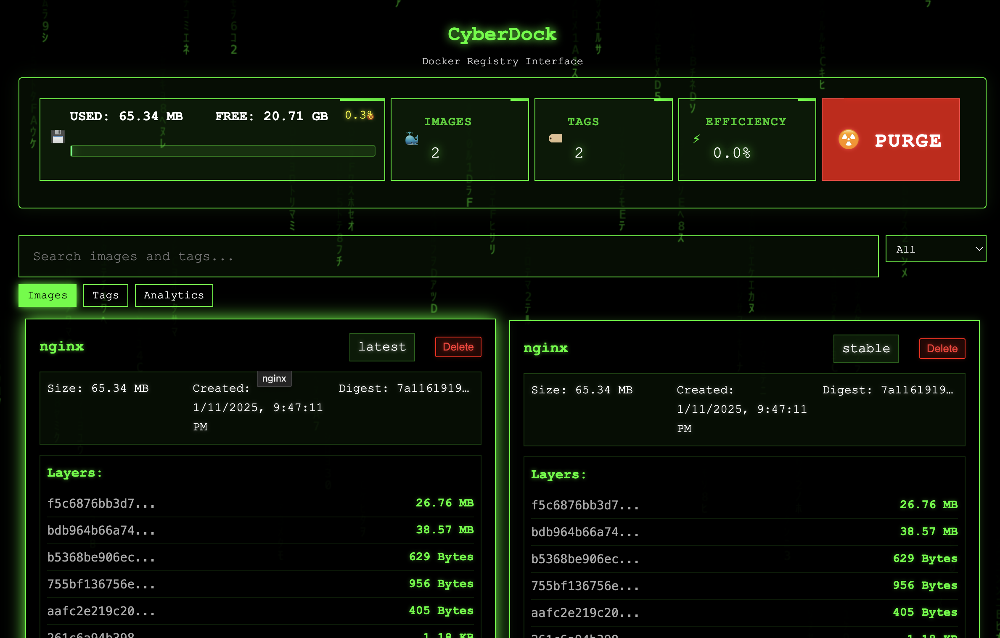

<div align="center">
  <h1>CyberDock</h1>
  <p><strong>Cyberpunk Docker Registry Interface</strong></p>
  <p>🐳 Docker Registry | 🌍 Web UI | ⚡ Fast | 🎨 Beautiful | 🔒 Secure</p>
  <p>
    
    
    
    
  </p>
</div>

CyberDock is a sleek, cyberpunk-themed Docker Registry with an integrated web interface. It combines a fully compliant OCI Distribution registry with a beautiful, real-time UI for managing your container images.

> The intention is to provide a simple, secure, and efficient way to replay and manage your Docker images.

## 🌟 Features

<table>
  <tr>
    <th>Registry Features</th>
    <th>Content Support</th>
  </tr>
  <tr>
    <td>
      <ul>
        <li>Full OCI Distribution Specification compliance</li>
        <li>Local filesystem storage with deduplication</li>
        <li>Efficient blob mounting between repositories</li>
        <li>Atomic operations for data integrity</li>
        <li>Automatic cleanup of incomplete uploads</li>
        <li>Real-time storage statistics</li>
        <li>Built-in garbage collection</li>
      </ul>
    </td>
    <td>
      <ul>
        <li>Docker V2 manifests and lists</li>
        <li>OCI manifests and image indexes</li>
        <li>Container configs</li>
        <li>Layer tarballs</li>
        <li>Cross-repository blob mounting</li>
        <li>Range request support</li>
        <li>🎉v0.2.0:Garbage collection</li>
      </ul>
    </td>
  </tr>
  <tr>
    <th>Web Interface</th>
    <th>Security</th>
  </tr>
  <tr>
    <td>
      <ul>
        <li>Cyberpunk-themed responsive design</li>
        <li>Real-time statistics and monitoring</li>
        <li>Image and tag management</li>
        <li>Storage efficiency tracking</li>
        <li>Layer analysis and visualization</li>
        <li>Search and filtering capabilities</li>
        <li>Secure HTTPS access</li>
      </ul>
    </td>
    <td>
      <ul>
        <li>Automatic TLS certificate generation</li>
        <li>Content verification through digests</li>
        <li>Proper file permissions</li>
        <li>Safe concurrent access</li>
        <li>Secure temporary file handling</li>
      </ul>
    </td>
  </tr>
</table>

## 🚀 Quick Start

### Docker

Docker image is a simple way to get started.
```bash
docker run -d --name cyberdock -p 5000:5000 -p 5001:5001 mattrogers/cyberdock:latest
```

1. Access the interfaces:
   - Registry: https://localhost:5000
   - Web UI: https://localhost:5001

## 💻 Usage

CyberDock runs two servers:
- Registry server on port 5000
- Web UI server on port 5001

### Docker Configuration

Add to your Docker daemon configuration:
```json
{
  "insecure-registries": ["localhost:5000"]
}
```

### Push Images
```bash
docker tag your-image:tag localhost:5000/your-image:tag
docker push localhost:5000/your-image:tag
```

### Pull Images
```bash
docker pull localhost:5000/your-image:tag
```

## 🔧 Configuration

Default ports:
- Registry: 5000
- Web UI: 5001

Command line flags:
```bash
-r PORT  # Set registry port (default: 5000)
-g PORT  # Set web UI port (default: 5001)
```

<div align="center">

## ⚖️ License

<p>
CyberDock is licensed under the GNU General Public License v3.0 (GPLv3).<br>
<em>Free Software</em>
</p>

[](https://www.gnu.org/licenses/gpl-3.0)

### Connect With Me 🤝

[](https://github.com/RamboRogers)
[](https://x.com/rogerscissp)
[](https://matthewrogers.org)

</div>

